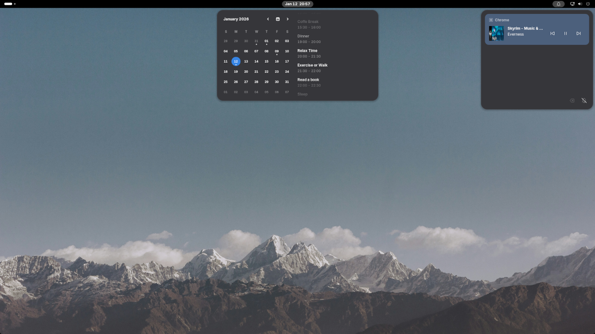

# Nowa Shell

Light visual and usability adjustments for GNOME Shell 48.

## Features

<p align="center">
  
</p>

- Fine-tuned shell appearance with corrected border radius and padding
- Subtly rounded screen corners
- Dedicated notification panel separated from calendar
- Calendar with enhanced event list
- Suppresses redundant notifications ("app is ready", "app has been pinned")
- Power panel with direct actions
- Dark Style toggle with automatic theme switching menu
- Minimalist Dash to Dock theme (optional)

## Installation

```bash
chmod +x bin/install.sh
./bin/install.sh
```

## Development

### Debug Logs
```bash
./bin/debug.sh
```

### Uninstall
```bash
./bin/uninstall.sh
```

## Code Style

This project follows StandardJS style: [https://standardjs.com](https://standardjs.com).

## Buy Me a Coffee

If you enjoy this extension, consider supporting the development:

[](https://www.paypal.com/donate/?hosted_button_id=KQXTZ4MH4JRZU)

## Bug Reports & Feature Requests

Please use the [issue tracker](https://github.com/nowaos/ext-nowa-shell/issues) to report any
bugs or file feature requests.

## Contributing

See [AUTHORS](AUTHORS) for a list of contributors and acknowledgments.

## License

This program is distributed under the terms of the GNU General Public License, version 3 or later.
